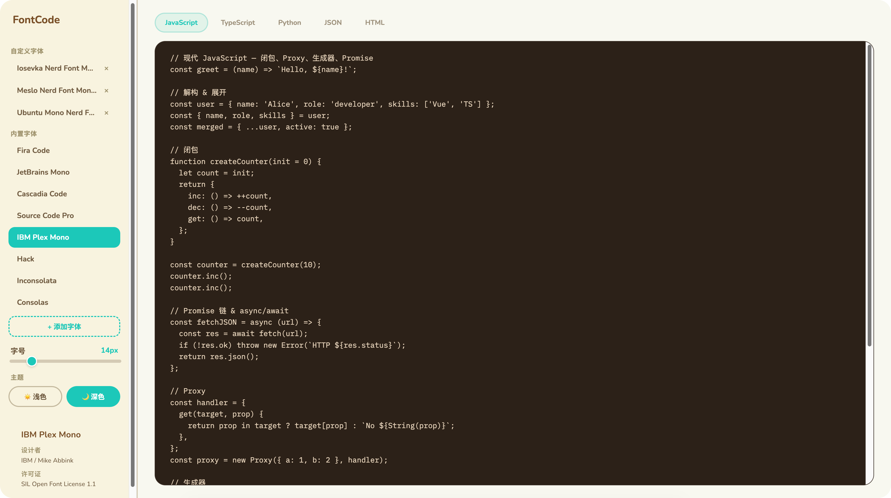

# FontCode

> 在线编程字体预览平台 — 打开网页就能逐款对比、调节字号、切换深浅主题。


## 预览



## 特性

- 8 款精选编程字体 + 自定义字体导入（URL / 本地文件 / Nerd Fonts 完整目录）
- 实时字号调节、深浅主题切换
- JS / TS / Python / JSON / HTML 代码片段，Prism.js 高亮
- 动森风格 UI，纯静态、零后端

## 快速开始

```bash
# 环境要求：Node.js ≥ 18

npm install
npm run dev      # 默认 http://localhost:6173
npm run build    # 类型检查 + 打包到 dist/
npm run preview  # 本地预览构建产物
```

## 自定义字体

侧边栏点击 **+ 添加字体**，三种方式任选：

- **网站字体**：粘贴 Google Fonts CSS 链接或 .woff2/.ttf/.otf 直链
- **本地字体**：上传 .woff2/.ttf/.otf/.woff 文件
- **Nerd Fonts**：从内置完整目录中挑选

导入后会自动持久化到浏览器 IndexedDB。

## 更新 Nerd Fonts 完整目录

Nerd Fonts 列表来自 `src/data/nerd-fonts-catalog.generated.json`，由脚本从上游仓库生成。如需更新到最新版本：

```bash
npm run gen:nerd-fonts
```

如遇 GitHub API 限速，可设置 token：

```bash
GITHUB_TOKEN=ghp_xxx npm run gen:nerd-fonts
```

生成后将 `src/data/nerd-fonts-catalog.generated.json` 一并 commit 即可，运行时通过 dynamic import 加载，无需在线请求 GitHub API。

## 部署

仓库已配置 `.github/workflows/deploy.yml`：在 GitHub **Settings → Pages** 把 Source 设为 **GitHub Actions**，推送 `main` 即自动部署。

## 许可证

[MIT](./LICENSE)。收录的开源字体遵循各自许可证（多为 [SIL OFL 1.1](https://scripts.sil.org/OFL)）。
